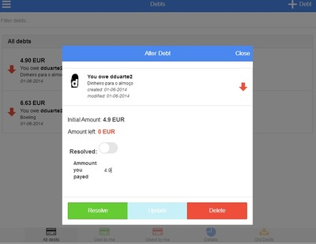

Payback
===============
In our daily lives and in groups of friends or coworkers,  it is easy to lose track of all the money that gets borrowed between people. For snack machines, coffee and even lunch, people often need to borrow some money. However, after a couple of “loans”, its difficult to remember to who we owe money or who is in our debt.

Payback is a financial tool/application that allows the user to manage and collect their debts in an easy and intuitive fashion. With it, users can keep records of all personal debts and loans and easily transfer their debts to someone who owes the user money, keeping things well organized. It also facilitates splitting costs for expenses shared by groups of people, such as group meals or other activities, by allowing groups of users to take on a shared debt.

Further info: [report](sdis1314_t6g02/final_SDIS1314_T6G02.pdf) (pdf)

API documentation: https://dduarte.github.io/Payback/api.html

Live at http://payback-app.herokuapp.com/ (Heroku)


# Client

The client was developed with the Ionic Framework (more details: <http://ionicframework.com/>).

## Intalling and running

* ``` sudo npm install -g cordova ```
* ``` sudo npm install -g ios-sim ```

Build project with:

* cd src/MobileClient
* ``` cordova build ios ``` or ``` cordova build android ```

Run with:

* ```cordova emulate ios ```
* ``` cordova emulate android ```

# Server

The server was developed in [node.js](http://nodejs.org/) with the [ExpressJs](http://expressjs.com/) framework.

## Installing and running

Install node if required: <http://nodejs.org/download/>

Go to the src/Server directory and run:

* ``` npm install ```
* ``` node server.js ```

## Screens

 
 
 
 
 
 
